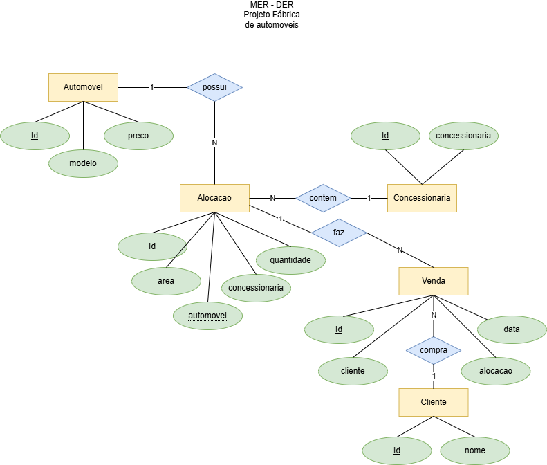

# Fabrica de Automoveis 2025
Projeto full stack, baseado na prova do SAEP de 2023, que simula o sistema de uma fábrica de automóveis. O sistema permite o cadastro, consulta, atualização e exclusão de informações sobre veículos, clientes, concessionárias e vendas.

## Ambiente de Desenvolvimento
- Node.js
- Express
- XAMPP (MySQL)
- Visual Studio Code
- HTML, CSS, JavaScript

## Instruções para Configuração do Projeto
1. Clone o repositório para sua máquina local.
2. Acesse a pasta API e execute `npm install` para instalar as dependências.
3. Abra o XAMPP e inicie o servidor Apache e MySQL.
4. Crie o arquivo /api/.env com as variáveis de ambiente necessárias para acessar o banco de dados.
```js
DATABASE_URL="mysql://root@localhost:3306/fabrica2025"
```
5. Faça a migração do banco de dados executando `npx prisma migrate dev --name init` na pasta API.
6. Importe os dados iniciais abrindo o Banco de dados pelo phpMyAdmin ou pelo shell 'mysql -u root' e execute o script `./docs/importacao.sql`.
7. Inicie o servidor da API com `node server.js` ou `npm run dev` na pasta API.
8. Abra a pasta web no Visual Studio Code e utilize a extensão Live Server para rodar o front-end.

## DER


## Screenshots
### Página Inicial
